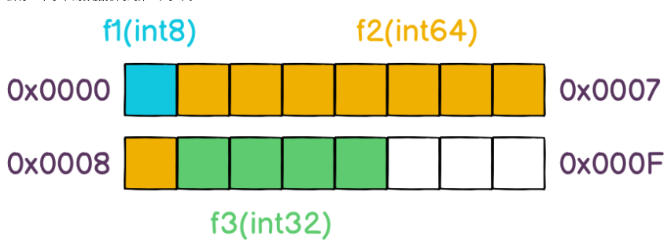
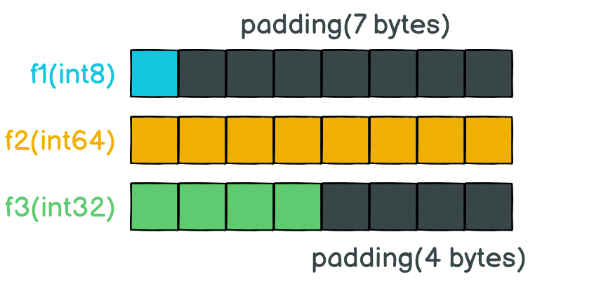
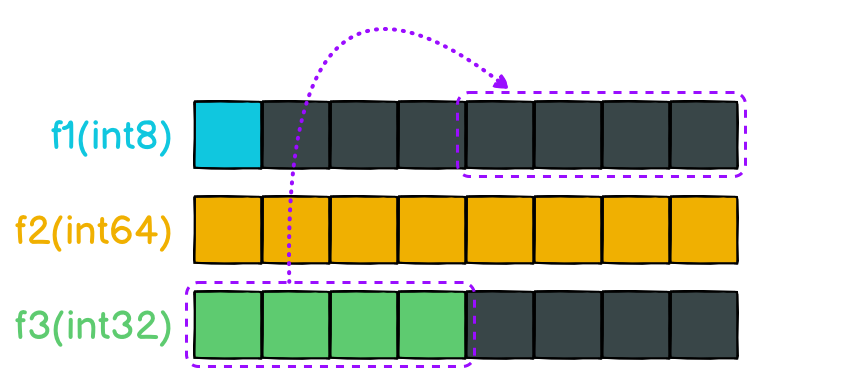
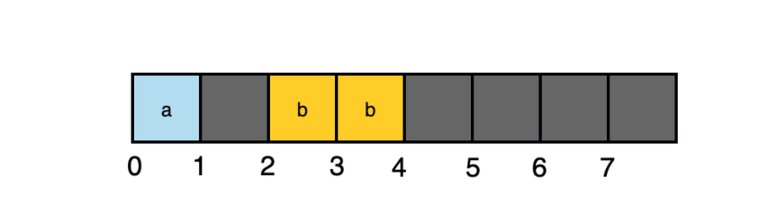

## 一、背景

为什么相同的结构体T1和T2，他们的unsafe.Sizeof()不一样呢！！！

```golang
type T1 struct {
    f1 int8  // 1 byte
    f2 int64 // 8 bytes
    f3 int32 // 4 bytes
}

type T2 struct {
    f1 int8  // 1 byte
    f3 int32 // 4 bytes
    f2 int64 // 8 bytes
}

func main() {
    fmt.Println(runtime.GOARCH) // amd64

    t1 := T1{}
    fmt.Println(unsafe.Sizeof(t1)) // 24 bytes

    t2 := T2{}
    fmt.Println(unsafe.Sizeof(t2)) // 16 bytes
}
```

## 二、原因刨析

**原理**：CPU按字的方式从内存中读取数据，64位的机器，CPU一次可以从内存中读取64位的数据，即8个字节。

### 模拟情景：如果GO编译器未对T1进行内存对齐




**程序要想读取f2字段的数据，那CPU就得花两个时钟周期把f2字段从内存中读取出来。**

### 内存对齐

**原理：** 是指内存地址是所存储数据大小（按字节为单位）的整数倍，以便**CPU可以一次将该数据从内存中读取出来**。


重新排列后，内存的布局会长如下这样，有13个字节的空间是真正存储数据的，而深色的11个字节的空间则是为了对齐而填充上的，不存储任何数据，以确保每个字段的数据都会落到同一个字长里面，所以才会有了开头的13个字节的数据类型实际上变成了24字节。

## 三、合理利用内存对齐

在Go程序中，Go会按照结构体中字段的顺序在内存中进行布局，所以需要将字段f2和f3的位置交换，定义的顺序变成int8、int32、int64


## 四、同一个字（8字节）中的内存分布

```golang
var x struct {
    a bool
    b int16
}
```



**原理：**

1.内存对齐是指数据存放的地址是数据大小的整数倍。也就是说会有数据存放的起始地址%数据的大小=0

2.构体变量中成员的偏移量必须是成员大小的整数倍

我们来验证下上面的结构体的排列。假设结构体的起始地址为0，那么a从0开始占用1个字节。b字段如果放在地址1处，套用上面的公式 1 % 2 = 1，就不满足对齐的要求。所以在地址为2处开始存放b字段
